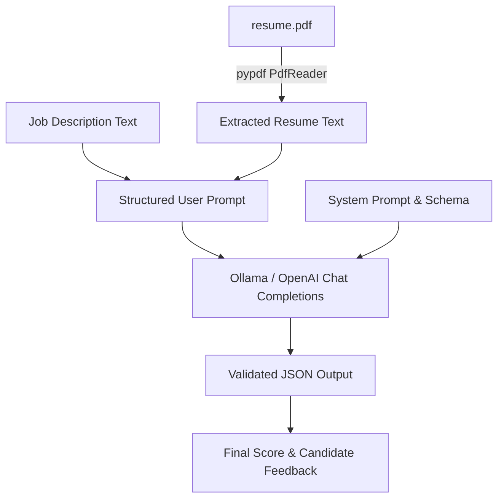

# Resume Parser & Job Description Matcher

Welcome to the **Resume Parser & Job Description Matcher** project! This module extracts candidate details directly from PDF resumes (`resume.pdf`), compares them against job descriptions (e.g. Qualcomm Software Engineer role), and returns structured JSON outputs evaluated by **Pydantic** schema models and LLMs (Ollama / OpenAI API).

---

## 📋 Table of Contents
1. [Overview](#-overview)
2. [Key Features](#-key-features)
3. [Environment Setup & Installation](#-environment-setup--installation)
4. [Pydantic Schema & Data Model](#-pydantic-schema--data-model)
5. [System Workflow](#-system-workflow)
6. [Usage & Execution](#-usage--execution)
7. [Future Enhancements](#-future-enhancements)

---

## 🎯 Overview

Extracting candidate profiles from unstructured PDF resumes and matching them against complex job requirements is a core LLM engineering task. This project uses:
- **`pypdf.PdfReader`**: Local text extraction from candidate PDF files.
- **LLM Structured Output Enforcement**: Enforces JSON response formats matching Pydantic schemas.
- **Automated Match Scoring**: Evaluates candidate experience, skills, and match percentage against specific job requirements.

---

## ✨ Key Features

- **Direct PDF Extraction**: Reads text directly from `resume.pdf` using `pypdf`.
- **Structured Pydantic Model**: Enforces candidate fields (`name`, `email`, `phone`, `yoe`, `linkedin`, `github`, `protfolio`, `codingProfile`, `achievements`, `finalScore`, `feedback`, `skills`).
- **Targeted Prompting**: Delimits resume text and job description into clear structured sections (`### Candidate Resume` and `### Job Description`).
- **Compatibility Scoring & Feedback**: Calculates a candidate match score (0-100%) and provides contextual feedback.

---

## 🛠️ Environment Setup & Installation

### 1. Virtual Environment Setup (macOS)
Navigate to the `resume_parser` directory and activate the virtual environment:

```bash
cd "/Users/himanshujha/Documents/AI Engineering/week1/resume_parser"
python3 -m venv venv
source venv/bin/activate
```

### 2. Dependencies
Install required packages using `uv` (recommended) or `pip`:

```bash
# Using uv workspace
uv add openai pydantic python-dotenv ollama pypdf

# Or using standard pip
pip install openai pydantic python-dotenv ollama pypdf
```

### 3. Environment Variables
Ensure `.env` exists in `resume_parser` or the workspace root:

```env
OLLAMA_BASE_URL="http://localhost:11434/v1"
OLLAMA_MODEL="llama3.2"
```

---

## 📐 Pydantic Schema & Data Model

The project defines the candidate resume and evaluation schema using Pydantic:

```python
from pydantic import BaseModel

class Resume(BaseModel):
    name: str
    email: str
    phone: int
    yoe: int
    linkedin: str
    github: str
    protfolio: str
    codingProfile: str
    achievements: str
    finalScore: int
    feedback: str
    skills: list

schema = Resume.model_json_schema()
```

---

## 🔄 System Workflow



1. **PDF Text Extraction**: `PdfReader("resume.pdf")` extracts text across all pages.
2. **Prompt Assembly**: Formats system prompt and user prompt with separated Markdown sections.
3. **LLM Completion**: Calls `client.chat.completions.create` with `response_format={"type": "json_object"}`.
4. **JSON Output**: Returns populated JSON matching the `Resume` schema.

---

## 🚀 Usage & Execution

Place your target resume PDF as `resume.pdf` in the `resume_parser` directory, then run:

```bash
python resume_parsing.py
```

### Output Example
```json
{
  "name": "Himanshu Jha",
  "email": "himanshuprincejha2001@gmail.com",
  "phone": 7070987129,
  "yoe": 1,
  "linkedin": "linkedin.com/in/himanshujhaa",
  "github": "github.com/himanshuujhaa",
  "protfolio": "",
  "codingProfile": "LeetCode 2100+",
  "achievements": "Global Rank 374 in LeetCode Weekly Contest 452",
  "finalScore": 85,
  "feedback": "Candidate meets preferred qualifications with 1+ year experience in Java, Python, SQL, and APIs.",
  "skills": ["Java", "Python", "SQL", "Spring Boot", "Git", "REST APIs"]
}
```

---

## 🔮 Future Enhancements

- [ ] Add `pydantic.model_validate_json` parsing to handle fallback field defaults.
- [ ] Support multiple PDF resumes in batch processing.
- [ ] Add Streamlit UI for uploading PDF resumes and pasting job descriptions.
