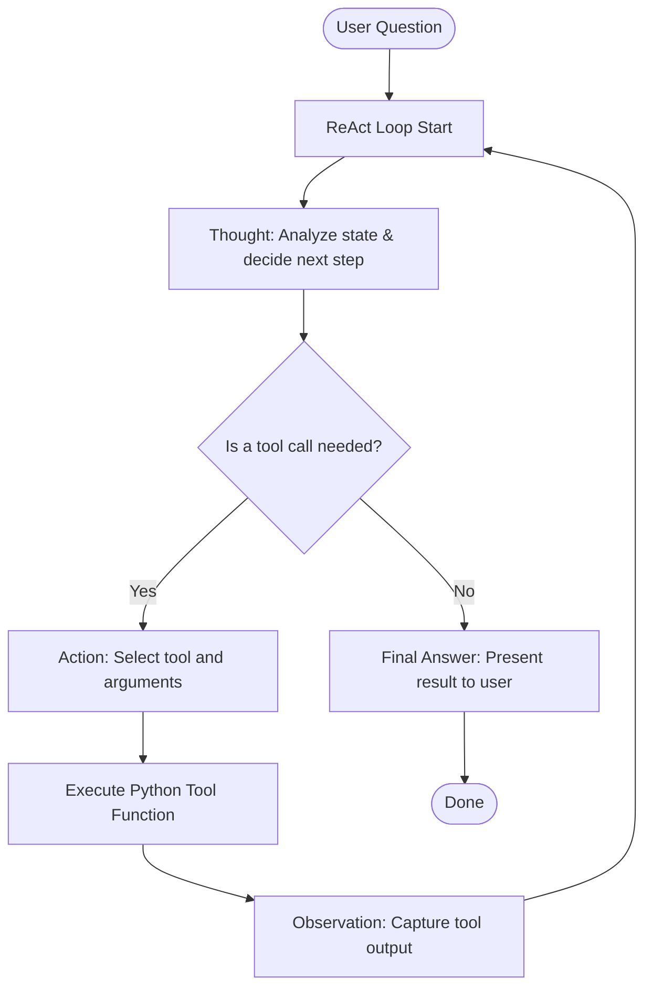

# Week 2 - Day 7: ReAct (Reasoning & Acting) Agent from Scratch

Welcome to Day 7 of the AI Engineering curriculum! Today, we built a **ReAct (Reasoning and Acting) Agent** completely from scratch without using any agent libraries (like LangChain, LlamaIndex, or AutoGen). This exercise helps demonstrate how agentic loops, tool execution, and state management function under the hood.

---

## 📅 Summary of Work

- **Objective:** Design and implement a simple ReAct agent that can query product prices and execute mathematical operations to answer multi-step customer queries.
- **Stack:** Python 3, OpenAI SDK configured to communicate with a local Ollama service, and a custom regex parser for execution routing.
- **Troubleshooting Solved:**
  - Bootstrapping `pip` in the local virtual environment (`.venv`) when it was missing (`python3 -m ensurepip`).
  - Installing dependencies (`python-dotenv` and `openai`) in the virtual environment.
  - Fixing missing module imports (`re` and `time.sleep`) in [react_chain.py](file:///Users/himanshujha/Documents/AI%20Engineering/week2/day7/react_chain.py).

---

## 🧠 Understanding the ReAct Pattern

The **ReAct** (Reasoning + Acting) pattern, introduced by Yao et al. (2022), allows LLMs to solve complex tasks by interleaving reasoning steps with action steps.



### The Core Loop
1. **Thought:** The model reasons about the user's request and plans what to do next.
2. **Action:** The model triggers a tool call matching a specific format, e.g., `Action: get_product_price("iphone 17")`.
3. **Observation:** The runtime intercepts the action, runs the Python function, and returns the result (the "Observation") back to the model's message history.
4. **Repeat:** The model reads the observation and decides whether it has enough info to formulate a `Final Answer` or needs another loop.

---

## 🛠️ Implementation & Architecture

The project consists of a single script, [react_chain.py](file:///Users/himanshujha/Documents/AI%20Engineering/week2/day7/react_chain.py), structured as follows:

### 1. Registering Tools
Tools are simple Python functions registered in a dictionary for easy lookups:
```python
def get_product_price(product):
    if product == "iphone 17":
        return 1000
    if product == "iphone 15":
        return 500
    return 0

def calculate(expression):
    try:
        return eval(expression)
    except:
        return "Calculation error!"

tools = {
    "get_product_price": get_product_price,
    "calculate": calculate
}
```

### 2. The ReAct System Prompt
The system prompt defines strict formatting rules to force the model to output steps in a readable and parseable format:
```text
Thought: What you need to do
Action: tool_name(argument)

Final Answer: your answer
```
It also includes clear guidelines forbidding conversational preambles and instructing the model to *STOP* immediately after writing an `Action` so the interpreter can run the tool.

### 3. Loop and Parsing Engine
Inside `run_agent(question)`:
- We track dialogue history in the `messages` array.
- We run up to 5 loop steps.
- We parse the LLM's response using the following regular expression:
  ```python
  match = re.search(r"Action: \s*(\w+)\((.*?)\)", answer)
  ```
- If an action is found, we extract the function name and arguments, call the function from our `tools` dictionary, and append both the LLM's action and the tool's `Observation` to the conversation history.

---

## 🐛 Troubleshooting & Resolutions

During development, we resolved several critical runtime issues:

### 1. Missing `pip` in Virtual Environment
* **Issue:** Running pip install failed with `/Users/.../day7/.venv/bin/python3: No module named pip`.
* **Root Cause:** The virtual environment was initialized without packaging tools (`pip`/`setuptools`).
* **Fix:** Bootstrapped `pip` inside the virtual environment by running:
  ```bash
  python3 -m ensurepip
  ```

### 2. Missing Dependencies
* **Issue:** Python script crashed with `ModuleNotFoundError: No module named 'dotenv'`.
* **Fix:** Installed required dependencies directly inside the active virtual environment:
  ```bash
  python3 -m pip install python-dotenv openai
  ```

### 3. Unimported Python Core Packages
* **Issue:** `NameError: name 're' is not defined` and `NameError: name 'sleep' is not defined` occurred during execution.
* **Fix:** Added the missing imports at the top of [react_chain.py](file:///Users/himanshujha/Documents/AI%20Engineering/week2/day7/react_chain.py):
  ```python
  import re
  from time import sleep
  ```

---

## 🔍 Execution Walkthrough

Here is the trace of the agent successfully answering:  
*"I have 5000 rupees. What is the price of an iphone 17? and how much money will I have left ?"*

### 📥 Step 1
* **Thought:** Find out the price of iPhone 17 and calculate the remaining amount.
* **Action:** `get_product_price("iphone 17")`
* **Observation:** `1000`

### 📥 Step 2
* **Thought:** Calculate the remaining amount after buying the iPhone 17.
* **Action:** `calculate(5000 - 1000)`
* **Observation:** `4000`

### 📥 Step 3
* **Final Answer:** You will have 4000 rupees left after buying the iPhone 17.
