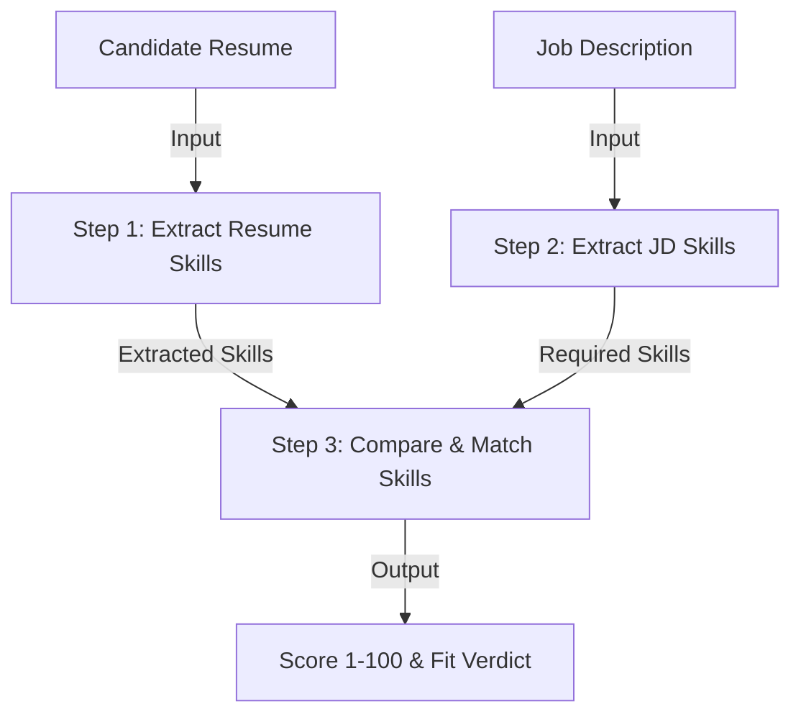

# Week 2 - Day 8: Prompt Chaining for Resume Evaluation

Welcome to Day 8 of the AI Engineering curriculum! Today, we designed and implemented a **Prompt Chaining** pipeline to evaluate how well a candidate's resume matches a job description (JD). 

Instead of asking a single prompt to extract skills, compare them, and score them all at once, we broke the task down into a sequential chain of modular prompts. This increases accuracy, makes the pipeline easier to debug, and improves overall reliability.

---

## 📅 Summary of Work

- **Objective:** Build an automated pipeline to extract resume skills, extract JD skills, and compute a matching score (1-100) and fit verdict.
- **Stack:** Python 3, virtual environment (`.venv`), `python-dotenv`, `openai` SDK (connecting to local Ollama).
- **Core Pattern:** Prompt Chaining (Sequential workflow feeding the output of one step as the input to the next).

---

## 🧠 What is Prompt Chaining?

**Prompt Chaining** is a design pattern where the output of one LLM call is passed as the input to the next LLM call. 

By splitting a complex task into multiple, smaller sub-tasks:
1. The LLM can focus on one specific instruction at a time (e.g., *only* extracting skills).
2. The outputs are cleaner and less prone to hallucination.
3. You can inspect and debug the intermediate outputs at each stage of the chain.



---

## 🛠️ Python f-strings for Dynamic Prompts

In Python, we inject dynamic variables (like the candidate's resume or the job description text) into our prompt templates. To do this efficiently, we use Python's **f-strings** (formatted string literals). 

> [!IMPORTANT]
> **Why use f-strings for prompts?**
> - It allows you to embed expressions and variables directly inside multi-line prompt strings using `{variable_name}` syntax.
> - Always prepend the multi-line string with an `f` (e.g., `f"""..."""`) when you want to pass variable values into the template.

### Example from the Code:
```python
def resume_extractor():
    system_prompt = """
    You are a professional HR assistant. Extract the skills from the candidates resume provided.
    Only return the skills, no other information. Do not invent any skills by yourself.
    """

    # We use an f-string here to pass the dynamic RESUME variable into the user prompt
    user_prompt = f"""
    This is Candidate Resume:

    {RESUME}
    
    Extract Skills:    
    """

    return ask_llm(system_prompt, user_prompt)
```

---

## 🚀 Execution & Setup

### 1. Prerequisites
Ensure you have started your local Ollama server. You can check if it is running by running:
```bash
curl http://localhost:11434/
```

### 2. Activate Virtual Environment & Run
Run the following commands to navigate to the Day 8 folder, activate the local environment, and run the chain:
```bash
cd "/Users/himanshujha/Documents/AI Engineering/week2/day8"
source .venv/bin/activate
python3 prompt_chain.py
```
