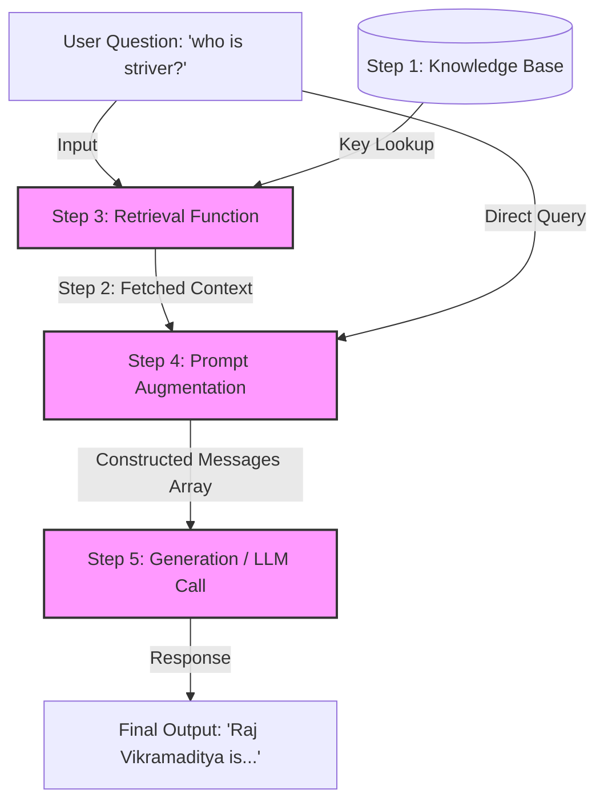

# Week 3 - Day 11: Introduction to RAG & OpenAI API Setup

Welcome to Day 11 of the AI Engineering curriculum! Today's focus is on setting up local LLM inference using Ollama and the OpenAI Python SDK, configuring a dedicated development environment, and learning how to structure system/user prompts for behavior control.

---

## 📅 Summary of Work

### 1. Environment Setup & Dependency Resolution
- **Virtual Environment:** Initialized a local virtual environment (`.venv`) inside the `week3/day11` folder for clean package isolation.
- **Pip Bootstrapping:** Resolved a missing `pip` issue inside the virtual environment by bootstrapping it using python's built-in `ensurepip` tool:
  ```bash
  ./.venv/bin/python3 -m ensurepip --default-pip
  ```
- **Dependencies Installed:** Installed the core libraries needed for interacting with local LLMs and loading environment configurations:
  - `python-dotenv`: To manage environment variables securely from a local `.env` file.
  - `openai` (v3.0.0+): The unified SDK interface to interact with local Ollama or cloud models.
  ```bash
  ./.venv/bin/python3 -m pip install python-dotenv openai
  ```

### 2. Ollama & OpenAI SDK Integration (`week3/day11/rag_intro.py`)
- **OpenAI Client Mapping:** Configured the `OpenAI` client class to route requests to a local **Ollama** server using the base URL and API keys specified in `.env`:
  ```python
  client = OpenAI(
      base_url=os.getenv("OLLAMA_BASE_URL"),
      api_key="ollama"
  )
  ```
- **API Response Handling:** Fixed a modern OpenAI SDK attribute bug where the response was accessed as `ans.response.choices[0]`. The response choices are directly available on the response object:
  ```python
  # Correct way to access content in v1.0.0+ of the SDK:
  return ans.choices[0].message.content
  ```

### 3. Prompting & Control Flow (Step 1)
- **Role Separation:** Structured the input payload to differentiate between different conversation roles:
  - **System Prompt:** Sets the persona, behavior, and formatting constraints (e.g., `"answer in one line"`).
  - **User Prompt:** The actual question or dynamic query provided by the user (e.g., `"who is striver ?"`).
- **Execution Workflow:** Created a modular function `ask_llm` to process questions and print the output.

---

## 🧠 Concepts Covered

### System Messages vs. User Messages
In chat completion interfaces, inputs are structured as a list of message objects, each assigned a specific `role`:

| Role | Purpose | Example |
| :--- | :--- | :--- |
| **System** | Defines the instructions, boundaries, constraints, tone, and overall behavior of the assistant. It acts as the "rules of play" for the LLM. | `"answer in one line"`, `"You are a code reviewer."` |
| **User** | Represents the end-user query or input prompt. | `"who is striver ?"`, `"Refactor this function."` |
| **Assistant**| Represents the response generated by the model. Can be used in chat history to show context. | `"Striver is a computer science educator."` |

### 4. 1st Generation RAG Pipeline (Step-by-Step Architecture)

A standard Retrieval-Augmented Generation (RAG) system consists of distinct, structured phases to feed external knowledge to an LLM:



Here are the detailed steps matching the code in `rag_intro.py`:

#### 🗄️ Step 1: Knowledge Base creation
The Knowledge Base acts as your private database of facts that the LLM was not trained on (or needs updated information for).
```python
# In-memory key-value dictionary acting as our document store
knowledge_base = {
    "striver": "Raj Vikramaditya, also known as Striver, is an Indian EdTech creator...",
    "actual name": "Raj Vikramaditya"
}
```

#### 🔍 Step 2 & 3: Retrieval of Context
The user's query is intercepted, parsed, and used to search the Knowledge Base for matching records.
```python
# Function to lookup matching facts based on keywords in the question
def reterival_info(question):
    question = question.lower()
    if "striver" in question:
        return knowledge_base.get("striver")
    ...
```

#### 📝 Step 4: Prompt Augmentation
The raw user question and the retrieved text context are formatted into a prompt template, which instructs the model to only use the provided context to answer the question.
```python
# System prompt injected with retrieved context
sys_prompt = f"Answer only based on this Context. Context: {context}"
system_message = {"role": "system", "content": sys_prompt}
message = {"role": "user", "content": question}

# Combine system constraints/context and user query
messages = [system_message, message]
```

#### 🤖 Step 5: Generation
The augmented message payload is sent to the LLM (Ollama), which acts as a reasoning engine to synthesize the final response based *only* on the provided context.
```python
# Generation step using the local model
ans = client.chat.completions.create(
    model=model,
    messages=messages
)
```

---

## 🛠️ Debugging & Bug Resolutions

When first running the RAG pipeline, we encountered three critical issues that caused the model to ignore the context and hallucinate:

### 1. Missing System Message in LLM Call
* **Problem:** Even though the retrieved context was formatted inside `system_message`, only the user's message was sent to the LLM:
  ```python
  messages = [message] # System message ignored
  ```
* **Resolution:** Passed both the system instruction (which contains the context) and user query to the client:
  ```python
  messages = [system_message, message]
  ```

### 2. Python Short-Circuiting Evaluation Bug
* **Problem:** The conditional check:
  ```python
  elif "acutal name" or "name" in question:
  ```
  always evaluated to `True` because `"acutal name"` is a non-empty string.
* **Resolution:** Rewrote it as:
  ```python
  elif "actual name" in question or "name" in question:
  ```

### 3. Key Lookup Mismatch & Case Sensitivity
* **Problem:** `.get("name")` was called, but the dictionary key was `"actual name"`. Also, query strings were not case-insensitive.
* **Resolution:** Updated the lookup to target the correct key (`"actual name"`) and converted the question to lowercase (`question.lower()`) before performing checks.

---

## ⚙️ Running the Code

To execute today's script within the virtual environment:

1. **Activate the virtual environment**:
   ```bash
   source .venv/bin/activate
   ```
2. **Execute the Python script**:
   ```bash
   python3 rag_intro.py
   ```
3. **Deactivate when finished**:
   ```bash
   deactivate
   ```
